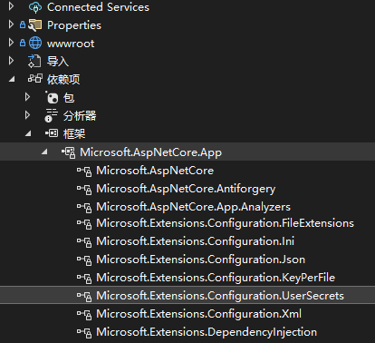

简单的说就是将机密信息存储到不同于项目目录中的本地文件中, 避免机密信息提交到代码库.

**a) `Microsoft.NET.Sdk.Web` 项目会自动包括对用户机密的支持:**



注意: 图片经过裁剪拼接, 请忽略和实际中看到的差异.

**b) `Microsoft.NET.Sdk` 项目需显式安装配置扩展和用户机密 NuGet 包:**

```bash
# 1. 使用 .NET CLI:
dotnet add package Microsoft.Extensions.Configuration
dotnet add package Microsoft.Extensions.Configuration.UserSecrets

# 2. 或使用 PowerShell:
Install-Package Microsoft.Extensions.Configuration
Install-Package Microsoft.Extensions.Configuration.UserSecrets
```

示例:

```csharp
using Microsoft.Extensions.Configuration;
namespace ConsoleApp;
class Program
{
    static void Main(string[] args)
    {
        // Web 应用则不需要 .AddUserSecrets<Program>()
        IConfigurationRoot config = new ConfigurationBuilder()
            .AddUserSecrets<Program>()
            .Build();
        Console.WriteLine(config["AppSecret"]);
    }
}
```

## 1. 启用机密存储

使用以下两种方式都会在工程文件中添加一个 `UserSecretsId` 元素:

```xml
<PropertyGroup>
  <TargetFramework>net9.0</TargetFramework>
  <!-- 该属性是自定义性质的, 因此无法使用智能补全 -->
  <UserSecretsId>79a3edd0-2092-40a2-a04d-dcb46d5ca9ed</UserSecretsId>
</PropertyGroup>
```

注意: `UserSecretsId` 属性的值必须是可以作为目录名称的字符(不是GUID也可以). 最好不要和其它项目使用同样的值, 除非你确定文件中的信息是可以多项目共享的.

### 1.1 使用 `dotnet user-secrets` 命令

```powershell
# 不带 "--id" 参数则会生成一个随机的 GUID
dotnet user-secrets init
```

以下是 [aspnetcore](https://github.com/dotnet/aspnetcore.git) 仓库中 `UserSecretsCreator.cs` 的源代码, 默认使用GUID来填充 `UserSecretsId` 属性:

```csharp
// Licensed to the .NET Foundation under one or more agreements.
// The .NET Foundation licenses this file to you under the MIT license.
using System.Linq;
using System.Xml;
using System.Xml.Linq;
using System.Xml.XPath;
using Microsoft.AspNetCore.Tools;
using Microsoft.Extensions.Tools.Internal;

internal static class UserSecretsCreator
{
    public static string CreateUserSecretsId(IReporter reporter, string project, string workingDirectory, string overrideId = null)
    {
        var projectPath = ResolveProjectPath(project, workingDirectory);

        // Load the project file as XML
        var projectDocument = XDocument.Load(projectPath, LoadOptions.PreserveWhitespace);

        // Accept the `--id` CLI option to the main app
        string newSecretsId = string.IsNullOrWhiteSpace(overrideId)
            ? Guid.NewGuid().ToString()
            : overrideId;

        // Confirm secret ID does not contain invalid characters
        if (Path.GetInvalidPathChars().Any(newSecretsId.Contains))
        {
            throw new ArgumentException(SecretsHelpersResources.FormatError_InvalidSecretsId(newSecretsId));
        }

        var existingUserSecretsId = projectDocument.XPathSelectElements("//UserSecretsId").FirstOrDefault();

        // Check if a UserSecretsId is already set
        if (existingUserSecretsId is not null)
        {
            // Only set the UserSecretsId if the user specified an explicit value
            if (string.IsNullOrWhiteSpace(overrideId))
            {
                reporter.Output(SecretsHelpersResources.FormatMessage_ProjectAlreadyInitialized(projectPath));
                return existingUserSecretsId.Value;
            }

            existingUserSecretsId.SetValue(newSecretsId);
        }
        else
        {
            // Find the first non-conditional PropertyGroup
            var propertyGroup = projectDocument.Root.DescendantNodes()
                .FirstOrDefault(node => node is XElement el
                    && el.Name == "PropertyGroup"
                    && el.Attributes().All(attr =>
                        attr.Name != "Condition")) as XElement;

            // No valid property group, create a new one
            if (propertyGroup == null)
            {
                propertyGroup = new XElement("PropertyGroup");
                projectDocument.Root.AddFirst(propertyGroup);
            }

            // Add UserSecretsId element
            propertyGroup.Add("  ");
            propertyGroup.Add(new XElement("UserSecretsId", newSecretsId));
            propertyGroup.Add($"{Environment.NewLine}  ");
        }

        var settings = new XmlWriterSettings
        {
            OmitXmlDeclaration = true,
        };

        using var xw = XmlWriter.Create(projectPath, settings);
        projectDocument.Save(xw);

        reporter.Output(SecretsHelpersResources.FormatMessage_SetUserSecretsIdForProject(newSecretsId, projectPath));
        return newSecretsId;
    }

    private static string ResolveProjectPath(string name, string path)
    {
        var finder = new MsBuildProjectFinder(path);
        return finder.FindMsBuildProject(name);
    }
}
```

源码位置: src\Tools\Shared\SecretsHelpers\UserSecretsCreator.cs

### 1.2 使用 Visual Studio 的管理用户机密功能

在 `Visual Studio` 中打开项目或解决方案:

右键项目 -> 管理用户机密

该操作会直接打开 `usersecrets.json` 文件, 并在工程文件中添加一个 `UserSecretsId` 元素.

## 提问1: 为何上面的示例代码中泛型类型为 `Program`?

只要是当前程序集下的类型都可以, 即配置了 `UserSecretsId` 的项目下的类型都可以.

以下是 [runtime](https://github.com/dotnet/runtime.git) 仓库中 `UserSecretsConfigurationExtensions.cs` 文件中摘取的部分代码示例:

```csharp
namespace Microsoft.Extensions.Configuration;
/// <summary>
/// Configuration extensions for adding user secrets configuration source.
/// </summary>
public static class UserSecretsConfigurationExtensions
{
    public static IConfigurationBuilder AddUserSecrets<T>(this IConfigurationBuilder configuration)
        where T : class
        => configuration.AddUserSecrets(typeof(T).Assembly, optional: true, reloadOnChange: false);

    public static IConfigurationBuilder AddUserSecrets(this IConfigurationBuilder configuration, Assembly assembly, bool optional, bool reloadOnChange)
    {
        ThrowHelper.ThrowIfNull(configuration);
        ThrowHelper.ThrowIfNull(assembly);
        UserSecretsIdAttribute? attribute = assembly.GetCustomAttribute<UserSecretsIdAttribute>();
        if (attribute != null)
        {
            return AddUserSecretsInternal(configuration, attribute.UserSecretsId, optional, reloadOnChange);
        }
        if (!optional)
        {
            throw new InvalidOperationException(SR.Format(SR.Error_Missing_UserSecretsIdAttribute, assembly.GetName().Name));
        }
        return configuration;
    }
}
```

源码位置: src\libraries\Microsoft.Extensions.Configuration.UserSecrets\src\UserSecretsConfigurationExtensions.cs

## 提问2: UserSecrets包是如何做到在项目程序集中添加一个 `UserSecretsIdAttribute` 的?

在 [runtime](https://github.com/dotnet/runtime.git) 仓库中 `Microsoft.Extensions.Configuration.UserSecrets` 工程目录下找到 `Microsoft.Extensions.Configuration.UserSecrets.targets` 文件:

```xml
<Project xmlns="http://schemas.microsoft.com/developer/msbuild/2003">
  <PropertyGroup>
    <MSBuildAllProjects Condition="'$(MSBuildVersion)' == '' Or '$(MSBuildVersion)' &lt; '16.0'">$(MSBuildAllProjects);$(MSBuildThisFileFullPath)</MSBuildAllProjects>
    <GenerateUserSecretsAttribute Condition="'$(GenerateUserSecretsAttribute)'==''">true</GenerateUserSecretsAttribute>
  </PropertyGroup>
  <!-- 此处向程序集中添加 UserSecretsIdAttribute -->
  <ItemGroup Condition=" '$(UserSecretsId)' != '' AND '$(GenerateUserSecretsAttribute)' != 'false' ">
    <AssemblyAttribute Include="Microsoft.Extensions.Configuration.UserSecrets.UserSecretsIdAttribute">
      <_Parameter1>$(UserSecretsId.Trim())</_Parameter1>
    </AssemblyAttribute>
  </ItemGroup>
</Project>
```

targets 文件位置: src/libraries/Microsoft.Extensions.Configuration.UserSecrets/src/buildTransitive/Microsoft.Extensions.Configuration.UserSecrets.targets

若 `GenerateAssemblyInfo` 为false, 则需要如下手动向程序集中添加  `UserSecretsIdAttribute` 属性:

```csharp
// AssemblyInfo.cs
[assembly: UserSecretsId("your_user_secrets_id")]
```

## 官方文档

<https://docs.microsoft.com/en-us/aspnet/core/security/app-secrets?view=aspnetcore-6.0&tabs=windows>
